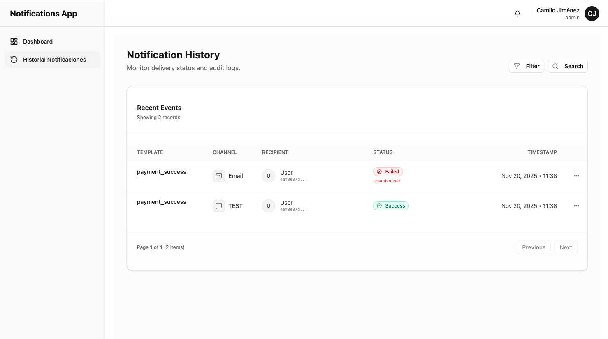
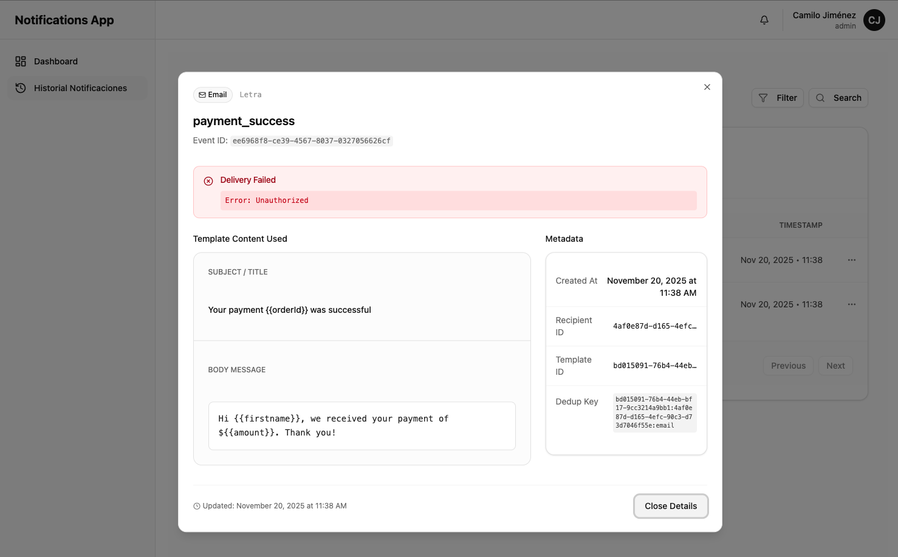

1. Use node version higher than 22.12.0
2. Install packages

```bash
npm install
```

3.  Copy `.template.env` to `.env`
4.  Run the project in dev environment

```bash
npm run dev
```

### Preview




